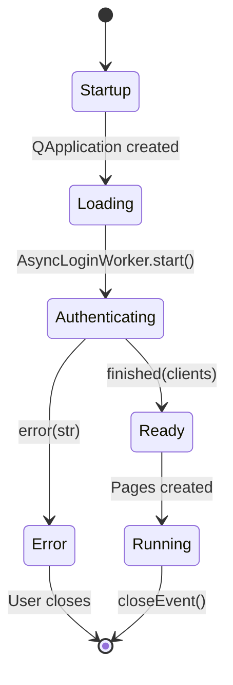

# GUI State Machine & Signal Flows

> Documentation for AI agents modifying `mygoog_gui/`.

## Application Lifecycle



## Core Components

| Component | File | Responsibility |
|-----------|------|----------------|
| `MainWindow` | `main.py` | Window shell, page navigation, layout |
| `Sidebar` | `widgets/sidebar.py` | Navigation buttons, emits `page_changed` |
| `ActivityWidget` | `widgets/activity.py` | Right sidebar activity log |
| `ThemeManager` | `theme_manager.py` | Dark/light theme switching |

## Signal Flow: Authentication

```
main()
  ├─► QApplication()
  ├─► ThemeManager.apply_theme()
  ├─► MainWindow(clients=None)
  │     └─► _init_loading_state() → Shows "Authenticating..."
  └─► AsyncLoginWorker.start()
        │
        ├─► finished(clients) → MainWindow._init_authenticated_state()
        │                         └─► _create_pages()
        │                         └─► sidebar.select_page(default)
        │
        └─► error(str) → QMessageBox.critical()
```

## Signal Flow: Page Navigation

```
Sidebar.button.clicked
  └─► Sidebar.page_changed.emit(name)
        └─► MainWindow._on_page_changed(name)
              └─► stack.setCurrentWidget(pages[name])
```

## Worker Thread Pattern

All API calls use `QThread` workers from `workers.py`:

| Worker | Purpose | Signals |
|--------|---------|---------|
| `ApiWorker` | Single API call | `finished(result)`, `error(Exception)` |
| `BatchApiWorker` | Batch with progress | `finished`, `error`, `progress(cur, total)` |
| `SyncWorker` | File scan + Sheets sync | `started_scan`, `started_upload(count)`, `finished(dict)`, `error(str)` |

### Usage Pattern

```python
# 1. Create worker
worker = ApiWorker(api_function, *args, **kwargs)

# 2. Connect signals
worker.finished.connect(on_success)
worker.error.connect(on_error)

# 3. Keep reference (avoid GC)
self._worker = worker

# 4. Start
worker.start()
```

## Theme/Settings State

```
SettingsPage.theme_combo.changed
  └─► ThemeManager.set_theme(name)
        ├─► AppConfig.ui_theme = name (persisted)
        └─► QApplication.instance().setStyleSheet(...)
```

## Key Entry Points for Modifications

| Task | Start Here |
|------|------------|
| Add new page | `main.py:_create_pages()`, `widgets/sidebar.py` |
| Add API call | Create `ApiWorker`, connect signals |
| Modify theme | `theme_manager.py`, `styles.py` |
| Add activity log | `ActivityModel.add_item()` |
| Background sync | Extend `SyncWorker` pattern |
